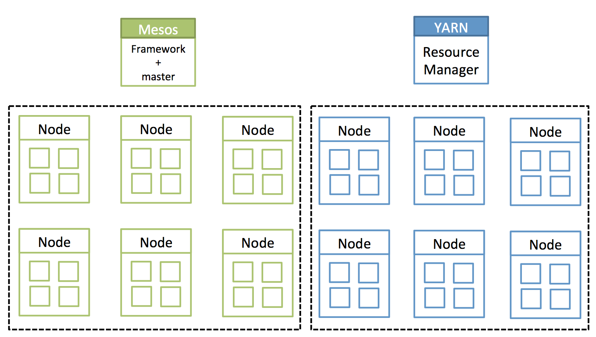
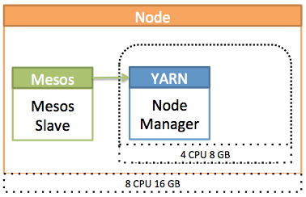
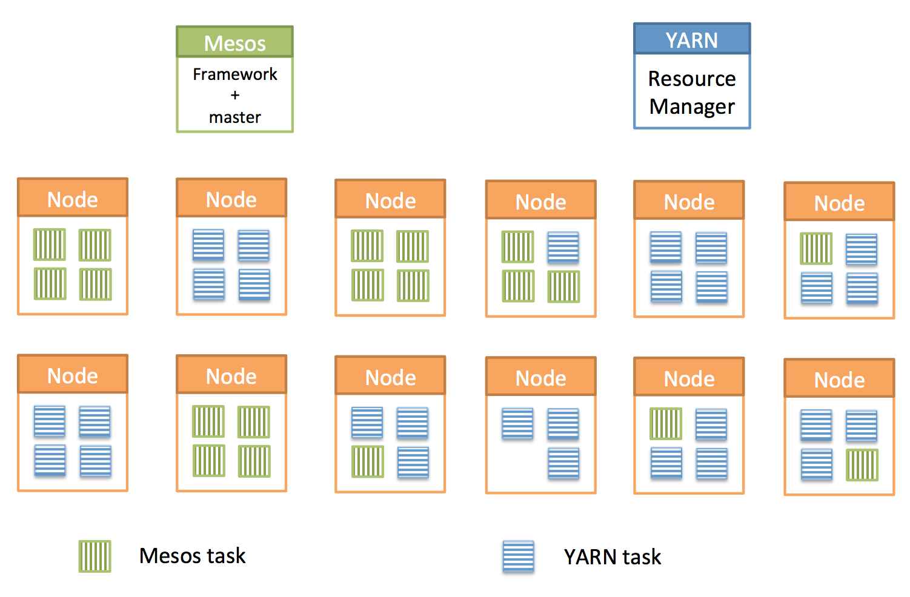
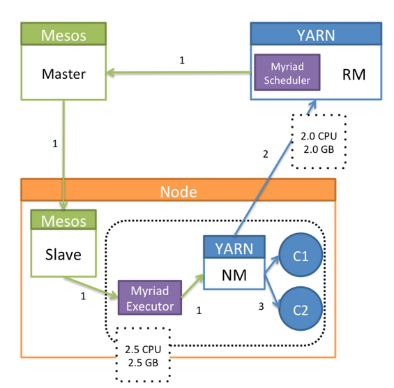

# How it Works?

## Introduction

Myriad allows Mesos and YARN to co-exist and share resources with Mesos as the resource manager for the datacenter. Sharing resources between these two resource allocation systems improves overall cluster utilization and avoids statically partitioning resources among separate clusters and separate resource managers.

The following diagram shows two resource managers running independently which results in a statically partitioned datacenter:



## Advertising Resources: Mesos Slave and YARN Node Manager

The Mesos Slave and YARN’s Node Manager are processes that run on the host OS. Both processes advertise available resources to Mesos Master and YARN Resource Manager respectively. Each process can be configured to advertise a subset of resources. This ability is leveraged, in conjunction with Cgroups, to allow Mesos Slave and YARN Node Manager to co-exist on a node.

* The Mesos Slave processes advertises all of a node’s resources (8 CPUs, 16 GB RAM) to the Mesos Master.
* The YARN Node Manager is started as a Mesos Task. This task is allotted (4 CPUs and 8 GB RAM) and the Node Manager is configured to only advertise 3 CPUs and 7 GB RAM.
* The Node Manager is also configured to mount the YARN containers under the  [cgroup hierarchy](cgroups.md)  which stems from a Mesos task. For example:

```bash
/sys/fs/cgroup/cpu/mesos/node-manager-task-id/container-1
```

The following diagram showsa node running YARN NodeManager as a Mesos Slave task:




## High Level Design

One way to avoid static partitioning and to enable resource sharing when running two resource managers, is to let one resource manager be in absolute control of the datacenter’s resources. The other resource manager then manages a subset of resources, allocated to it through the primary resource manager.

The following diagram shows a scenario where Mesos is used as the resource manager for the datacenter which allows both  Mesos and YARN to schedule tasks on any node.



Each node in the cluster has both daemons, Mesos Slave and YARN Node Manager, installed. By default, the Mesos slave daemon is started on each node and advertises all available resources to the Mesos Master.

The following diagram shows how Myriad launches a YARN Node Manager as a task under Mesos Slave:

1. Myriad makes a decision to launch a new NodeManager.
	* Myriad passes the required configuration and task launch information to the Mesos Master which forwards that to the Mesos Slave(s).
	* Mesos Slave launches Myriad Executor which manages the lifecycle of the NodeManager.
	* Myriad Executor upon launch, configures Node Manager (for example, specifying CPU and memory to advertise, Cgroups hierarchy, and so on) and then launches it. For example: In the following diagram, Node Manager is allotted 2.5 CPU and 2.5 GB RAM.
2. The YARN Node Manager, upon startup, advertises configured resources to the YARN Resource Manager. In the following example, 2 CPU and 2 GB RAM are advertised. The rest of the resources are used by the Myriad Executor and Node Manager processes to run.
3. The YARN Resource Manager can launch containers now, via this Node Manager. The launched containers are mounted under the configured Cgroup hierarchy. See [cgroups doc](cgroups.md) for more information.



---
<sub>
Licensed to the Apache Software Foundation (ASF) under one
or more contributor license agreements.  See the NOTICE file
distributed with this work for additional information
regarding copyright ownership.  The ASF licenses this file
to you under the Apache License, Version 2.0 (the
"License"); you may not use this file except in compliance
with the License.  You may obtain a copy of the License at

<sub>
  http://www.apache.org/licenses/LICENSE-2.0

<sub>
Unless required by applicable law or agreed to in writing,
software distributed under the License is distributed on an
"AS IS" BASIS, WITHOUT WARRANTIES OR CONDITIONS OF ANY
KIND, either express or implied.  See the License for the
specific language governing permissions and limitations
under the License.


