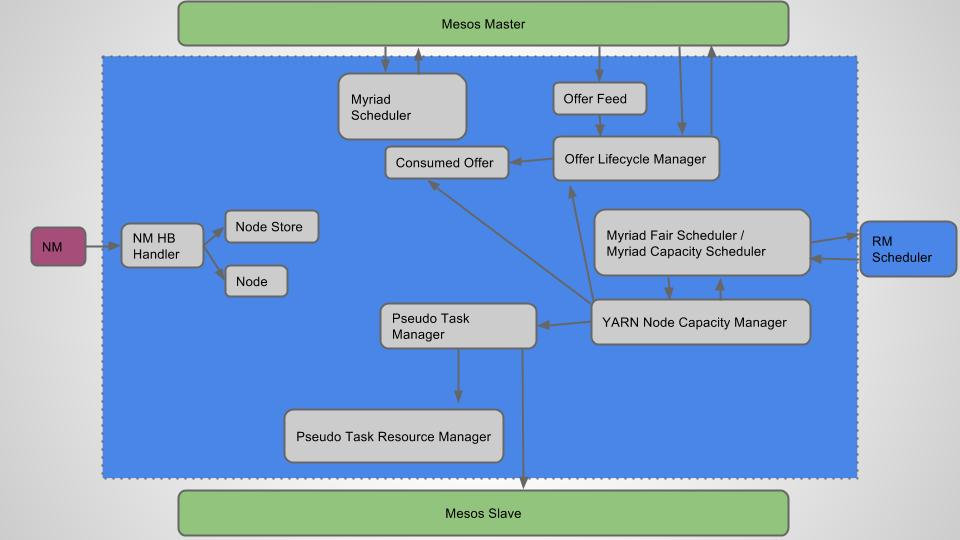

# Myriad Scheduler
Myriad scheduler is comprised of components that interact with YARN and Mesos
services. The following diagram outlines the main interactions.

## Mesos Master Interactions
* Myriad Scheduler

  This is the entry point to register a framework scheduler with Mesos. Upon
  registration, we start receiving Mesos offers.

* Offer Feed

  Mesos offers are accepted and stashed here.

* Offer Lifecycle Manager

  Interface to retrieve stashed offers, return unused offers back to Mesos.

* Consumed Offer

  Represents offers that have been consumed for a slave prior to scheduling run.
  When offers are consumed, they increase the capacity of YARN Node Manager by
  that amount. Note that no Mesos tasks are launched when offers are consumed.
  They are launched only after the scheduling run.

## Mesos Slave Interactions
* Pseudo Task Manager

  Interface to manage pseudo Mesos tasks that are launched to satisfy the container
  allocations done by YARN scheduler.

* Pseudo Task Resource Manager

  Interface to manage the resources consumed by psuedo Mesos tasks and reuse them
  as needed. Pseudo Mesos tasks are launched only when there isn't enough
  resources from existing tasks available to satisfy YARN container allocations.
  Similarly, when YARN containers complete, their resources are not immediately
  released back to Mesos. They are reused for the next scheduling run. When
  resources don't get used up after a scheduling run, they are released back to
  Mesos.

## Resource Manager Scheduler Interactions
* Myriad Fair Scheduler, Myriad Capacity Scheduler

  Extension point for YARN schedulers to enable setting up hooks into scheduler events.

* YARN Node Capacity Manager

  Controls the YARN Scheduler's view of the cluster node capacity. YARN schedules
  containers on nodes based on available capacity. Myriad enables YARN cluster
  elasticity by dynamically growing and shrinking the node capacities.

## Node Manager Interactions
* NM HB Handler

  Handles node manager heartbeat and responds to status updates of YARN
  containers. For running containers, it sends status update to Mesos Executor and
  for completed containers, it informs Pseudo Task Manager about available
  resources.

* Node Store

  Tracks the set of nodes that are part of YARN cluster.

* Node

  Tracks metadata about a node.
